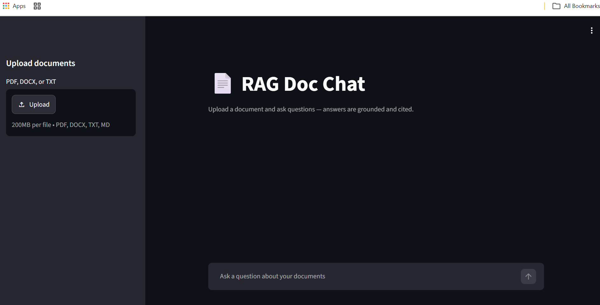

# AskFiles AI — RAG Doc Chat

### Production-oriented document Q&A using RAG, LLMs, and vector search

AskFiles AI is a deployed document intelligence application that lets users upload PDF, DOCX, or TXT files and ask questions about their content.

Answers are grounded exclusively in retrieved document context and include source citations, rather than relying on the model's general knowledge.

**Live Demo:** https://askfiles-ai.onrender.com/
*The demo is password-protected. Contact me for access.*

> **Portfolio project:** Built to demonstrate production-oriented RAG engineering patterns, provider abstraction, document isolation, security considerations, evaluation, and cloud deployment.

---

## Demo

**Live application:** https://askfiles-ai.onrender.com/

### Example workflow

1. Upload one or more PDF, DOCX, or TXT documents.
2. Ask questions about the uploaded content.
3. The system retrieves relevant document chunks.
4. The LLM generates an answer grounded in the retrieved context.
5. Answers include source file and page citations.
6. Questions outside the uploaded content are refused instead of answered from general knowledge.

### Screenshots



---

## Overview

The application implements an end-to-end Retrieval-Augmented Generation (RAG) pipeline:

```text
Documents
    ↓
Text extraction
    ↓
Page-aware chunking
    ↓
Embeddings
    ↓
Vector store
    ↓
Semantic retrieval
    ↓
LLM
    ↓
Grounded answer + citations
```

The architecture is designed around interchangeable LLM and vector-store providers. The core application logic can run with free/local development tools and can be configured to use managed cloud services without changing the RAG application layer.

The system also addresses practical concerns for a public-facing AI application, including session-level document isolation, prompt-injection screening, input limits, secret management, grounding evaluation, and protection against excessive free-tier usage.

---

## Key Features

* **Multi-file, multi-document Q&A** — upload multiple files into one session and ask questions across them
* **Citation-grounded answers** — answers cite `[source, page]` and are instructed not to answer outside the retrieved context
* **Session isolation** — documents are tagged with `session_id` and retrieval is restricted to the active session
* **Automatic session cleanup** — expired sessions and their vectors are purged automatically
* **Swappable LLM providers** — Gemini, OpenAI, and Azure OpenAI
* **Swappable vector stores** — Chroma, Pinecone, and Azure AI Search
* **Prompt-injection screening** on user input
* **Public endpoint hardening** — password protection and per-message length limits
* **Grounding evaluation** — automated evaluation against a fixed question/answer set, including an out-of-scope question
* **Dockerized deployment** — the application runs as a containerized service
* **Production-oriented architecture** — provider abstraction, isolation, security controls, and evaluation built into the application design

---

## Example Use Cases

The same architecture can be adapted for:

* 📄 Internal company knowledge bases
* 👥 HR and employee policy assistants
* 📑 Product and technical documentation assistants
* ⚖️ Legal and compliance document Q&A
* 🏢 Enterprise document search
* 🎓 Research and academic document assistants
* 🛠️ Customer-support knowledge bases
* 📚 Private document intelligence applications

---

## What This Project Demonstrates

| Skill                    | Implementation                                                   |
| ------------------------ | ---------------------------------------------------------------- |
| RAG chatbot development  | End-to-end ingestion → retrieval → generation                    |
| Document Q&A             | Multi-file and cross-document retrieval                          |
| LLM integration          | Gemini, OpenAI, and Azure OpenAI adapters                        |
| Vector / semantic search | Chroma, Pinecone, and Azure AI Search adapters                   |
| Embedding pipelines      | Page-aware chunking, metadata tagging, multi-provider embeddings |
| AI backend development   | FastAPI REST API                                                 |
| LLM evaluation           | Automated grounding evaluation                                   |
| LangChain                | Retrieval pipeline and text splitting                            |
| AI security              | Prompt-injection screening, access control, input limits         |
| Multi-tenant isolation   | Session-filtered vector retrieval                                |
| Cloud deployment         | Docker + Render                                                  |
| Provider abstraction     | Runtime configuration without changing core application logic    |

---

## How It Works

### 1. Document ingestion

Uploaded PDF, DOCX, or TXT files are processed and split into pages/chunks.

Each chunk retains metadata such as:

```text
source
page
session_id
```

### 2. Embedding and indexing

Document chunks are converted into embeddings and stored in the configured vector store.

```text
Chunk
  ↓
Embedding model
  ↓
Vector representation
  ↓
Vector store
```

### 3. Query retrieval

When a user asks a question, retrieval is restricted to the current `session_id`.

This prevents documents belonging to different sessions from being mixed during retrieval.

### 4. Grounded generation

The most relevant chunks are passed to the LLM as context.

The generation prompt instructs the model to:

* answer using the retrieved context
* provide `[source, page]` citations
* refuse questions that cannot be answered from the supplied context

### 5. Session cleanup

Sessions expire after `SESSION_TTL_HOURS`, after which associated vectors are purged.

---

## Architecture

```text
                         ASKFILES AI

┌──────────────────────┐
│     Streamlit UI     │
│                      │
│  Upload + Chat       │
└──────────┬───────────┘
           │
           ▼
┌──────────────────────┐
│    FastAPI Backend   │
│                      │
│ REST API + RAG       │
└──────────┬───────────┘
           │
     ┌─────┴──────────────┐
     │                    │
     ▼                    ▼
┌─────────────┐    ┌───────────────┐
│ RAG Pipeline│    │  Guardrails   │
└──────┬──────┘    └───────────────┘
       │
       ▼
┌──────────────────────┐
│    Vector Store      │
│                      │
│ Chroma / Pinecone /  │
│ Azure AI Search      │
└──────────┬───────────┘
           │
           ▼
┌──────────────────────┐
│     LLM Provider     │
│                      │
│ Gemini / OpenAI /    │
│ Azure OpenAI         │
└──────────────────────┘
```

### Deployment architecture

FastAPI and Streamlit run together inside a single Docker container on Render.

The FastAPI backend is bound internally and is not exposed as a public endpoint. The Streamlit application communicates with the backend server-side.

Production configuration:

```text
LLM_PROVIDER=gemini
VECTOR_STORE=pinecone
```

---

## Technical Highlights

### Provider-agnostic architecture

The application uses adapters for LLM and vector-store providers.

The architecture supports combinations of:

```text
LLM:
├── Gemini
├── OpenAI
└── Azure OpenAI

Vector Store:
├── Chroma
├── Pinecone
└── Azure AI Search
```

Providers are selected through environment variables without changes to the core RAG application logic.

### Embedding dimension validation

During development, Gemini embedding output was empirically validated rather than relying on an assumed dimensionality before configuring the vector database.

This prevented a potential vector-dimension mismatch from reaching the production indexing path.

### Cross-store metadata normalization

Different vector stores can normalize metadata types differently.

For example, page metadata can be returned as `1.0` instead of `1`.

The application normalizes metadata when reading it back so that citations remain consistent across vector-store implementations.

### Model lifecycle handling

Upstream model deprecations were handled by moving away from hardcoded retired Gemini model names and using the provider's supported latest-model alias pattern.

### Deployment portability

The application was originally targeted at Hugging Face Spaces and later moved to Render when the deployment requirements changed.

The Docker-based architecture allowed the hosting platform to be changed without restructuring the application.

### Public endpoint cost protection

Once deployed publicly, additional controls were introduced to protect free-tier resources:

* shared password gate
* per-message length limits
* restricted backend exposure
* generic client-facing errors

---

## Tech Stack

| Layer            | Technology                             |
| ---------------- | -------------------------------------- |
| Language         | Python                                 |
| Backend          | FastAPI                                |
| Frontend         | Streamlit                              |
| AI orchestration | LangChain                              |
| LLM              | Google Gemini / OpenAI / Azure OpenAI  |
| Vector store     | Chroma / Pinecone / Azure AI Search    |
| Embeddings       | Provider-configurable embedding models |
| PDF parsing      | pypdf                                  |
| DOCX parsing     | python-docx                            |
| Containerization | Docker                                 |
| Deployment       | Render                                 |
| Evaluation       | Custom grounding evaluation            |

---

## Provider Configuration

Providers are selected using environment variables.

### LLM

```env
LLM_PROVIDER=gemini
```

Supported:

```text
gemini
openai
azure_openai
```

### Vector store

```env
VECTOR_STORE=chroma
```

Supported:

```text
chroma
pinecone
azure_search
```

See `.env.example` for provider-specific configuration.

---

## Local Development

### 1. Create a virtual environment

```bash
python -m venv .venv
```

Activate it:

**Linux/macOS**

```bash
source .venv/bin/activate
```

**Windows**

```bash
.venv\Scripts\activate
```

### 2. Install dependencies

```bash
pip install -r requirements.txt
```

### 3. Configure environment variables

```bash
cp .env.example .env
```

For local development, use:

```env
LLM_PROVIDER=gemini
VECTOR_STORE=chroma
```

Add the required Gemini API key.

### 4. Start the backend

```bash
uvicorn app.main:app --reload --port 8091
```

### 5. Start the Streamlit UI

In another terminal:

```bash
streamlit run streamlit_app/app.py
```

The application should now be available through the Streamlit interface.

---

## Running the Evaluation

The project includes a repeatable grounding evaluation.

Run:

```bash
python tests/run_eval.py
```

The evaluation:

1. uploads a sample document
2. asks a fixed set of questions
3. checks expected answers/keywords
4. includes an out-of-scope question
5. verifies that the application does not answer unsupported questions from general knowledge

The evaluation currently uses keyword-based checks rather than a full RAG evaluation framework.

---

## Deployment

The application is deployed as a Docker container on **Render**.

Production configuration:

```text
LLM_PROVIDER=gemini
VECTOR_STORE=pinecone
```

The container runs:

```text
Streamlit UI
     +
FastAPI backend
```

The application uses Render's dynamically assigned `$PORT`.

> The public demo uses Render's free tier, which can introduce cold-start latency after periods of inactivity.

---

## Security

### Implemented

* Backend is not publicly exposed
* HTTPS provided by the hosting platform
* Secrets stored through environment variables
* No API keys committed to source control
* Session-based document isolation
* File-type restrictions
* Upload size limits
* Prompt-injection screening on user queries
* Forced grounding instructions
* Password protection for the public demo
* Per-message length limits
* Generic client-facing error responses
* Uploaded files processed in memory rather than written using user-controlled filenames

### Security limitations

This project is intentionally transparent about its current security boundaries.

The prompt-injection protection is currently a lightweight regex-based heuristic applied to user queries. Uploaded document content is not independently scanned for prompt injection.

This is appropriate for a portfolio/demo application, but would require stronger controls before being used with untrusted multi-party documents in a production enterprise environment.

---

## Limitations

* Prompt-injection protection is heuristic-based and can be bypassed through rephrasing.
* Uploaded document content is not scanned for malicious prompt instructions.
* Session tracking is currently in-memory.
* Container restarts can orphan vectors associated with sessions that existed before the restart.
* There is no per-IP rate limiting beyond the password gate and message-length limit.
* The Gemini free tier limits how much live demo traffic can be supported.
* Uploaded files are not malware-scanned.
* Render's free tier introduces cold-start latency after inactivity.

---

## Future Improvements

* Persistent session management
* Per-IP and per-session rate limiting
* Stronger prompt-injection detection
* Streaming responses
* Hybrid keyword + semantic retrieval
* Reranking
* Multi-user authentication and authorization
* Real RAGAS-based evaluation metrics
* CI pipeline for automated evaluation
* Azure OpenAI + Azure AI Search production demonstration
* Persistent document collections
* Usage and cost analytics

---

## What Can Be Built From This

This project provides a foundation for custom AI knowledge applications such as:

```text
                    Custom AI Knowledge Assistant
                              │
        ┌─────────────────────┼─────────────────────┐
        ▼                     ▼                     ▼
  Company Knowledge      HR / Policy          Technical Docs
      Assistant             Bot                  Assistant
        │                     │                     │
        └─────────────────────┼─────────────────────┘
                              ▼
                    RAG + LLM + Vector Search
```

A production implementation can be extended with:

* user authentication and authorization
* private knowledge bases
* multi-tenant architecture
* hybrid retrieval
* reranking
* enterprise search
* conversation history
* usage analytics
* evaluation pipelines
* monitoring and observability
* cloud-specific AI services

---

## License

MIT — see [`LICENSE`](LICENSE).
